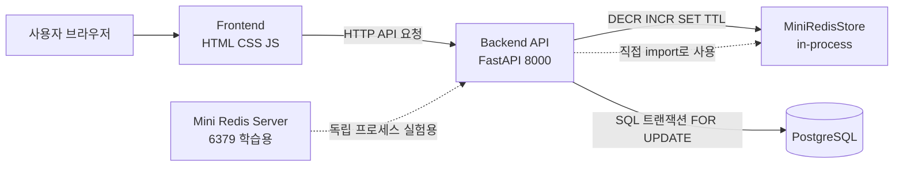

# 5조 MINI-REDIS Project 발표

## 발표 주제 
### Mini-Redis

---
## 디렉토리 구조
```
mini-redis-coupon/
├── frontend/          # 프론트엔드 (순수 HTML/CSS/JS)
│   ├── index.html     # 메인 페이지
│   ├── style.css      # 스타일시트
│   └── app.js         # API 통신 및 UI 로직
├── backend/           # FastAPI API 서버 (포트 8000)
│   ├── server.py      # API 엔드포인트
│   ├── .env           # DB 접속 정보
│   └── requirements.txt
├── mini-redis/        # Mini Redis 서버 (포트 6379)
│   ├── server.py      # 해시 테이블 기반 키-값 저장소
│   └── requirements.txt
├── database/          # PostgreSQL 초기화 SQL
│   ├── init.sql       # 테이블 생성
│   └── seed.sql       # 초기 데이터 (재고 100개)
├── tests/             # pytest 단위 테스트
│   ├── test_mini_redis.py  # Mini Redis 테스트
│   └── test_api.py         # API 서버 테스트
└── README.md
```
---

## 2. 시스템 아키텍처



### 핵심 설명

- 프론트는 백엔드 API만 호출하고, 발급/조회/테스트 결과를 화면에 표시합니다.
- 백엔드는 MiniRedisStore를 같은 프로세스에서 직접 호출해 게이트키퍼 역할을 수행합니다.
- PostgreSQL은 발급 이력 영속화와 DB 방식 비교 실험을 담당합니다.

---

## 3. 화면 1 - 단건 발급 비교

### 발표 흐름

1. 첫 화면에 진입합니다.
2. `Redis 발급` 버튼을 눌러 처리 시간을 확인합니다.
3. `재고 초기화` 후 `DB 발급` 버튼을 눌러 처리 시간을 확인합니다.
4. 단건 기준으로는 큰 차이가 없다는 점을 설명합니다.


## 4. 화면 2 - 1000명 동시 테스트

### 테스트 조건

- 재고를 먼저 **100개로 초기화**
- **1000개의 요청이 각각 독립적으로 동시에 들어오도록 설정**
- Redis 방식과 DB 방식을 **같은 조건**에서 순서대로 비교

### 발표 흐름

1. `1000명 동시 테스트` 버튼을 클릭합니다.
2. 결과 카드에서 Redis와 DB 처리 시간을 비교합니다.
3. Redis가 더 빠른 이유를 동시성 처리 방식 관점에서 설명합니다.

---

## 5. 화면 3 - TTL 유효성 확인 데모

### 발표 흐름

1. TTL 데모 화면으로 이동합니다.
2. `유효 쿠폰 조회`를 눌러 현재 살아 있는 쿠폰 목록을 확인합니다.
3. TTL이 남아 있을 때 `사용하기`를 눌러 사용 가능 여부를 확인합니다.
4. 만료 시간이 지난 뒤 다시 확인해서 사용 불가능 상태를 보여줍니다.

---

## 6. 마무리

정리하면,

- 단건 요청에서는 Redis와 DB의 차이가 아주 크지 않았습니다.
- 하지만 **1000명 동시 요청**처럼 트래픽이 몰리는 상황에서는 Redis의 원자적 `DECR`이 훨씬 유리했습니다.
- 그리고 TTL 기능을 통해 쿠폰의 **유효 시간 관리와 만료 처리**까지 간단하게 구현할 수 있었습니다.

즉, 이번 프로젝트를 통해 저희는 Redis를 단순 캐시가 아니라,

**선착순 제어, 트래픽 차단, 만료 처리까지 담당하는 실시간 이벤트 게이트키퍼**

로 활용할 수 있다는 점을 확인했습니다.

---

## 7. 주요 이슈와 의사결정

프로젝트 초기에 PostgreSQL과 저희 Mini Redis의 성능 차이가 예상보다 크게 보이지 않았습니다.
그래서 저희는 "비교 환경이 공정한가?"를 먼저 점검했습니다.

핵심 이슈는 통신 방식 차이였습니다.

- Mini Redis는 HTTP 기반으로 호출
- PostgreSQL은 TCP + 바이너리 프로토콜 기반으로 호출

이 차이 때문에, 구현 자체의 성능보다 통신 오버헤드가 결과에 영향을 줄 수 있다고 판단했습니다.
그래서 비교 초점을 "외부 통신"이 아니라 "동시성 제어 로직"에 맞추기 위해,
Mini Redis를 별도 서버 호출 방식 대신 **백엔드 내부 in-process 방식**으로 직접 사용하도록 결정했습니다.

다만 이번 프로젝트에서는 엣지 케이스를 더 폭넓게 검증하지 못한 점이 아쉬움으로 남았습니다.
이 부분은 이후 개선 과제로 가져가 보완할 예정입니다.

---

감사합니다.
